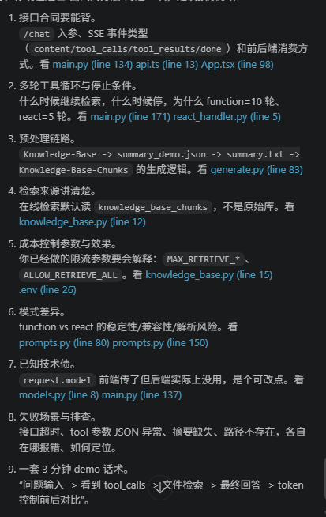

一句话定位
Deep RAG 在这个实现里是：先把知识库做成“结构化摘要地图”，再让 LLM 按路径主动调用 retrieve_files 去读文件，循环推理后回答，而不是先 embedding 再 top-k 召回。

核心链路（在线问答）

前端把用户消息发到 /chat，后端走流式 SSE 返回。
后端先读取 summary.txt（知识库地图），拼进 system prompt。
第一次模型调用：模型先看“地图”，决定直接答，或调用 retrieve_files(file_paths)。
若有工具调用，后端读取对应文件/目录内容作为 tool result。
把 tool result 追加到对话，再次调用模型。
重复直到产出最终答案（function 模式最多 10 轮，react 模式最多 5 轮）。

离线预处理链路

generate.py 扫描 Knowledge-Base 的 .md。
小文件直接摘要。
大文件按 token 拆分后摘要，并写入 Knowledge-Base-Chunks。
最终输出树状 summary.txt 作为“知识地图”。
和传统 RAG 的核心区别

传统 RAG：切块 -> embedding -> 向量检索(top-k) -> rerank -> 生成。
这个项目：文件摘要地图 -> LLM 规划路径 -> 按路径读文件 -> 多轮工具推理 -> 生成。
传统 RAG 召回单元是“chunk”，这里召回单元更偏“文件/目录”。
传统 RAG 强依赖向量相似度，这里强依赖“摘要质量 + LLM 选路能力”。
这个仓库当前不走 embedding/rerank/tavily 主链路。
它的好处

保留目录和文档结构语义，跨文档关系更自然。
对比较、否定、全局汇总、多跳推理更友好。
可解释性更好，能看到模型到底读了哪些路径。
工程简单，不需要先上向量库和复杂召回栈。
它的代价

如果模型检索范围过大，token 和成本会暴涨。
延迟更高，多轮工具调用天生更慢。
知识库很大时扩展性不如成熟向量检索架构。
对摘要质量敏感，摘要偏差会误导检索路径。
你面试时可以这样讲
“我做的是一个 Agentic Deep RAG。它不是先做向量召回，而是先给模型一个知识库结构地图，让模型按文件路径主动检索，再多轮推理回答。这个机制在复杂逻辑和跨文档问题上表现更稳定，但也带来 token 成本和延迟挑战，所以我专门做了检索限流和上下文压缩优化。”

关键代码锚点（你可直接复盘）

main.py (line 118)
prompts.py (line 7)
knowledge_base.py (line 40)
react_handler.py (line 5)
generate.py (line 1)
App.tsx (line 79)
下一步如果你愿意，我可以直接给你做一版“面试讲解稿（3分钟版 + 8分钟版）”，按面试官提问节奏来设计。